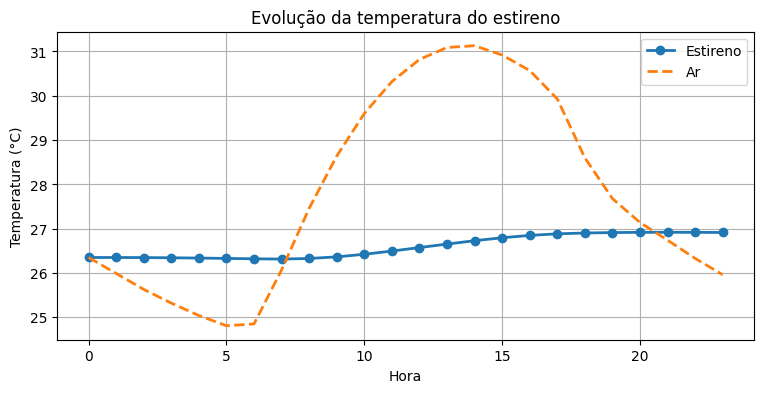

[](https://colab.research.google.com/github/NuclearPhysicist/styrene-accident-physics-modeling/blob/main/styrene_accident_manaus.ipynb)

# Computational Modeling of a Styrene Accident Scenario in Manaus

This repository contains a computational investigation of physical phenomena associated with a styrene spill accident scenario in Manaus, Brazil.

The project was developed as an investigative teaching approach for Physics education, combining thermodynamics, heat transfer, fluid mechanics, atmospheric dispersion, chemical processes, and structural analysis.

## Overview

The computational model investigates physical phenomena associated with the heating and release of styrene from a storage tank.

The notebook explores simplified mathematical and physical models to estimate and analyze:

- Temperature evolution;
- Heat transfer;
- Styrene evaporation;
- Internal pressure;
- Vapor pressure using the Clausius–Clapeyron equation;
- Polymerization;
- Energy release;
- Structural effects on the storage tank;
- Atmospheric dispersion of the released material.

The objective is not to reproduce the complete industrial accident with a high-fidelity engineering simulation. Instead, the project uses physically grounded simplified models to investigate how different phenomena can be connected and analyzed computationally.

## Example Result

### Temperature Evolution

The figure below illustrates the temperature evolution obtained from the simplified thermal model implemented in the notebook.



## Educational Context

This project was developed as an investigative and interdisciplinary approach to Physics education.

The accident scenario provides a real-world context for the application of fundamental concepts from:

- Thermodynamics;
- Heat transfer;
- Ideal gas behavior;
- Phase equilibrium;
- Chemical processes and polymerization;
- Energy conservation;
- Mechanical stress;
- Atmospheric dispersion.

The notebook combines theoretical discussion, mathematical equations, numerical calculations, graphical visualization, and computational modeling.

## Computational Notebook

The main notebook of this repository is:

`styrene_accident_manaus.ipynb`

It contains the complete sequence of calculations, explanations, equations, Python code, and graphical results developed for the project.

## Main Physical Models

The following models are explored throughout the notebook.

### 1. Heat Transfer

Estimation of the temperature evolution of the styrene and the associated energy transfer.

### 2. Evaporation

Estimation of the amount of styrene that could be vaporized as a consequence of the thermal energy available.

### 3. Internal Pressure

A simplified upper-bound estimate based on the Ideal Gas Law is compared with a more realistic equilibrium approach based on vapor pressure.

### 4. Vapor Pressure

The integrated Clausius–Clapeyron equation is used to estimate the variation of styrene vapor pressure with temperature.

### 5. Polymerization

The potential contribution of polymerization to the energy balance of the accident scenario is investigated.

### 6. Structural Analysis

The internal pressure is used to estimate the mechanical stress imposed on the storage tank.

### 7. Atmospheric Dispersion

Simplified dispersion models are used to investigate the transport of released material in the atmosphere.

## Requirements

The computational notebook was developed using Python and the following libraries:

- NumPy
- Matplotlib
- Requests
- Pillow

The required dependencies are listed in the `requirements.txt` file.

They can be installed using:

```bash
pip install -r requirements.txt
